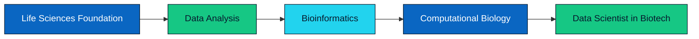

 

 
 

---

## Hey, I'm Sanchit

I am a **B.Sc. Life Sciences student** at **Sri Aurobindo College, University of Delhi**, preparing for a career as a **data scientist in biotech, healthcare, research, or another data-driven field**.

I am learning to connect **biology + data + computation**: from analysing biological sequences to exploring molecular interactions and turning complex datasets into clear visual stories.

 

<table>
  <tr>
    <td align="center" width="33%">
       
      <b>DATA</b> 
      Python, SQL, R, Excel, Power BI, statistics & ML
    </td>
    <td align="center" width="33%">
       
      <b>BIOLOGY</b> 
      Molecular biology, genetics, biotechnology & drug discovery
    </td>
    <td align="center" width="33%">
       
      <b>COMPUTATION</b> 
      Sequence analysis, docking, MD simulation & RNA-seq
    </td>
  </tr>
</table>

 

> **Mission:** build useful, accessible tools and insights at the intersection of data science and life sciences.

---

## Current Focus

<table>
  <tr>
    <td width="50%" valign="top">
      <h3>Learning Now</h3>
      <ul>
        <li>Python data analysis with <b>NumPy, pandas, seaborn, and Matplotlib</b></li>
        <li><b>Excel, SQL, Power BI, R</b>, dashboards, and data storytelling</li>
        <li>Statistics and practical machine-learning foundations</li>
        <li>Microsoft <b>DL-600</b> and <b>Data Analyst with AI</b> by Physics Wallah</li>
      </ul>
    </td>
    <td width="50%" valign="top">
      <h3>Biology + Computation</h3>
      <ul>
        <li>Biopython, BLAST, NCBI, UniProt, PDB, and sequence analysis</li>
        <li>Molecular docking and structure-based drug discovery</li>
        <li>Molecular dynamics (MD) simulation fundamentals</li>
        <li>RNA-seq analysis and omics data exploration</li>
      </ul>
    </td>
  </tr>
</table>

`BIOLOGY` &nbsp; + &nbsp; `CODE` &nbsp; + &nbsp; `CURIOSITY` &nbsp; = &nbsp; `BETTER QUESTIONS`

---

## Projects

<table>
  <tr>
    <td width="50%" valign="top">
      <h3 align="center">BioEdge India</h3>
      

      
<i>An AI-powered learning platform for Indian life sciences students.</i>

      

        
        
        
      

      <ul>
        <li>AI biology chatbot powered by Gemini</li>
        <li>Curated life sciences AI-tool directory</li>
        <li>Career guidance and recommendation tools</li>
      </ul>
    </td>
    <td width="50%" valign="top">
      <h3 align="center">GeneScope Web</h3>
      

      
<i>A browser-based toolkit for DNA sequence analysis.</i>

      

        
        
        
      

      <ul>
        <li>Six-frame ORF detection and visualisation</li>
        <li>Needleman-Wunsch global alignment</li>
        <li>Primer melting temperature, GC-content, and restriction-site analysis</li>
      </ul>
    </td>
  </tr>
</table>

### NEURAL FEED IN PROGRESS

<i>An AI-news aggregator prototype built with React.</i>

---

## Skill Constellation

<b>Data Science & Analytics</b> 

 

 
 

<b>Computational Biology</b> 

 

---

## My Aim From Student to Scientist

---

### Let's connect and build something useful for life sciences.

<i>"Learning biology, data science, and computational tools by building projects that make life sciences easier to explore."</i>

